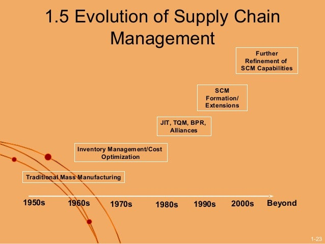

# DHL-SUPPLY-CHAIN-ANALYSIS

 ## DISCLAIMER:
All dataset and reports do not represent any company,institution or country but just a dummy dataset to demostrate capabilities of powerbi

## INTRODUCTION:
DHL is a stalwart in the realm of supply chain solutions. With an unwavering commitment to optimizing logistics and fostering operational efficiency, DHL stands
as a beacon of excellence. Leveraging cutting-edge technology and strategic expertise, they navigate the intricate landscape of global trade, seamlessly connecting suppliers and consumers.
Their holistic approach ensures streamlined processes, from procurement to distribution, driving cost savings
and customer satisfaction. As pioneers in supply chain management, DHL continues to redefine industry standards, catalyzing growth and success for partners across diverse sectors.
This project is to analyse and derive insights to answer crucial questions and help stakeholders make data driven decisions.This ia a power bi anlysis of an imaginary enterprise.

 ## PROBLEM STATEMENT:
Build a robust data model that reduces redundancy, optimizes report speed and performance, and enables efficient analysis of sales data for the aforementioned product categories. 
