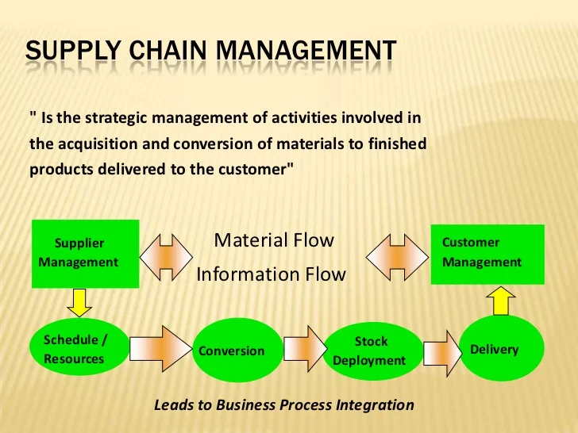

# DHL-SUPPLY-CHAIN-ANALYSIS

 ## DISCLAIMER:
All dataset and reports do not represent any company,institution or country but just a dummy dataset to demostrate capabilities of powerbi

## INTRODUCTION:
DHL is a stalwart in the realm of supply chain solutions. With an unwavering commitment to optimizing logistics and fostering operational efficiency, DHL stands
as a beacon of excellence. Leveraging cutting-edge technology and strategic expertise, they navigate the intricate landscape of global trade, seamlessly connecting suppliers and consumers.
Their holistic approach ensures streamlined processes, from procurement to distribution, driving cost savings
and customer satisfaction. As pioneers in supply chain management, DHL continues to redefine industry standards, catalyzing growth and success for partners across diverse sectors.
This project is to analyse and derive insights to answer crucial questions and help stakeholders make data driven decisions.This ia a power bi anlysis of an imaginary enterprise.

 ## PROBLEM STATEMENT:

 
 

 ## OBJECTIVE:
 

## SKILLS AND CONCEPTS DEMOSTRATED:
- Primary keys and Foreign Keys 
- Power query
- ETL
- Normalization and Analysis 
- Modelling
- slicers
- Data analysis and Data visualisation

## KPI'S:
 here are some insights that can be gotten from analysing  the KPI:

- The total revenue generated from the sale of products is $577,604.82.

- The manufacturing and quality control cost is $52,369.76.

- The total number of products sold is 46,099.

- The total number of products in inventory is 100.

From this data, we got the following although not displayed:

- Profit: $525,235.06 (577,604.82 - 52,369.76)

- Profit margin: 90.93% (525,235.06 / 577,604.82)

- Average selling price per product: $12.52 (577,604.82 / 46,099)

- Inventory turnover ratio: 460.99 (46,099 / 100)

### KPI RECOMMENDATIONS:
This means that the company is making a very good profit on its products. The profit margin is over 90%, which is very high.

The average selling price per product is relatively low, which suggests that the company is targeting the budget-friendly market. The inventory turnover ratio is very high, which means that the company is selling its inventory very quickly.

Overall, the data suggests that the company is performing very well. It is making a good profit, its products are selling well, and its inventory turnover ratio is high.

Here are some additional insights:

The company could consider increasing its prices slightly, as its profit margin is already very high. This would allow the company to generate even more revenue.

The company should continue to monitor its inventory levels and ensure that it has enough products in stock to meet demand.

The company could also consider expanding its product line to include new and different types of products. This would allow the company to reach a wider range of customers and increase its sales.

  

